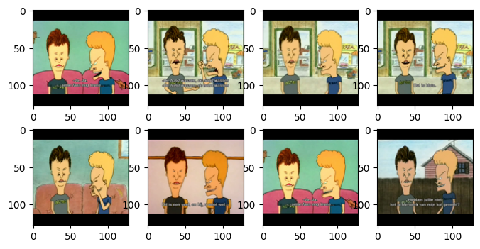
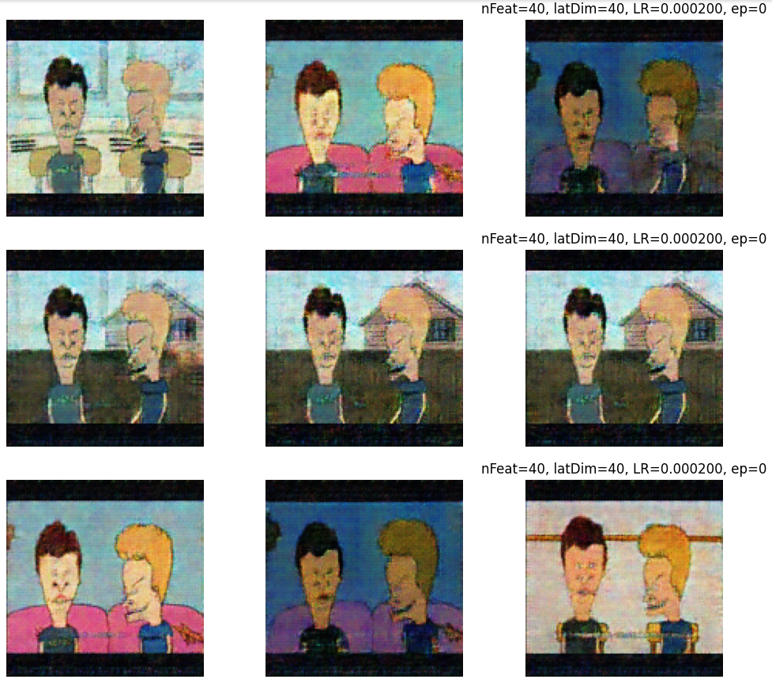

# BeavisGAN

Simple GAN which generates Beavis and Butthead frames.

Training data and weights not included.

# Source material

Source material was compiled from Season 1 and 2. I edited a 7 minute clip made from all scenes where the two were shown on screen from the waist up and where Butt-head is on the left. These frames were then extracted to PNG, scaled and letterboxed to 128x128. From the total 14k frames only the first 4k were used due to available computational resources.

Example source material:

# Example output

